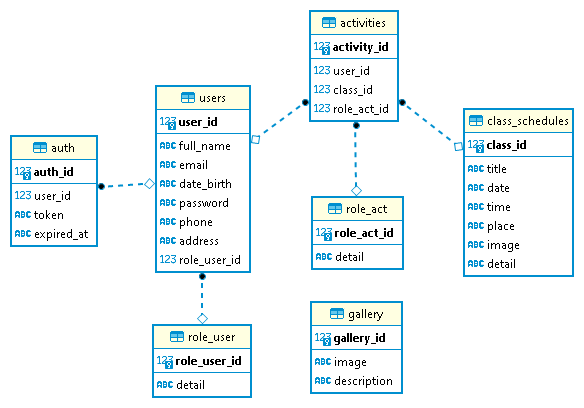

# Final Project Kelompok 74 - VolunteerEdu


Sebuah platform berbasis website yang mengadakan  kelas pembelajaran secara tatap muka maupun daring kepada anak-anak maupun orang tua di daerah-daerah Indonesia .

------
## Reminder! 
This repository is just a clone for the frontend service to deploy. 
- This link for the github main code : https://github.com/rg-km/final-project-engineering-74
- This link for the github backend deploy : https://github.com/arincantikam26/volunteeredu
- This link for the github frontend deploy : https://github.com/rafiakbar13/kelompok-74

------

## Table of Contents

- [Profile Team](#profile-team)
- [Requirements](#requirements)
- [Getting Started](#getting-started)
  - [Server URL](#server-url)
  - [How to Run Service](#how-to-run-service)
  - [Available Users Login](#available-users-login)
  - [Unit Testing](#unit-testing)
- [Cors Blocked Installation](#cors-addblocks-installation)
- [Backend](#backend)
  - [Available API](#available-apis)
- [Frontend](#frontend)
  - [API Documentation](#api-documentation)
- [Technology Used](#technology-used)
- [Assets VolunteerEdu](#assets-volunteeredu)
  - [Mockup Design](#mockup-design)
  - [ERD Database](#erd-database)
  - [Pitch Deck](#pitch-deck)

------

## Profile Team
|ID | Nama | Role | Profile |
| ------ | ------ | ------ | ------ |
| BE2122257 | Arin Cantika Musi | Backend Engineer | [arincantikam26](https://github.com/arincantikam26) |
| BE2244403 | Dewi Sugianti | Backend Engineer | [dewsgnt](https://github.com/dewsgnt) |
| FE2311163 | Muhammad Rafi Akbar | Frontend Engineer | [rafiakbar13](https://github.com/rafiakbar13) |
| FE2306138 | Sechan Al Farisi | Frontend Engineer | [alfarisisechan](https://github.com/alfarisisechan) |
| FE2239831 | Ni Luh Dita Oktaviari | Frontend Engineer | [ditaoktaviari](https://github.com/ditaoktaviari) |
| FE2001900 | Dzihan Septiangraini | Frontend Engineer | [DzihanSeptiangraini](https://github.com/DzihanSeptiangraini) |

------

## Requirements

- There are two users, admin and volunteer/participant.
- User should able to signup to the system.
- User should able to login to the system.
- User should able to logout from the system.
- User should able to choose role in class.
- User should able to check gallery activities.
- User should able to check list activities class.
- Admin should able to get list user.
- Admin should able to manage class schedules.
- Admin should able to manage gallery.

------

## Getting Started

### Server URL
- Backend
https://go-volunteeredu.herokuapp.com/api/v1/classes

- Frontend
https://final-project-14h7uhyn0-rafiakbar13.vercel.app/

### How to run service
**Alert! : Before run service in localhost, please install addblock chrome and add ekstensions CORS for avoid CORS Blocked when using app!** [Clik this how to install adblock CORS](#cors-addblocks-installation)

Run the following code in terminal:
1. Migration: run `main.go` inside directory `final-project-engineering-74\backend\database\migration` to Migration database SQLite
```
cd backend/database/migration
go run main.go
```

2. Main Service: run `main.go` inside directory `final-project-engineering-74\backend` to running main service
```
cd backend/
```
```
go run main.go
```


3. Main Page: run `npm start` inside directory `final-project-engineering-74\frontend` ro running main page
```
cd frontend/
npm start
``` 
nb : you must run inside the root directory `final-project-engineering-74`

### Available Users Login
1. Admin
  Email : admin@gmail.com
  Password : admin123
2. Users
    - Users 1
    Email : arin@gmail.com
    Password : 12345678
    - Users 2
    Email : dewi@gmail.com
    Password : 12345678
    - Users 3 > Enable to register with new user

### Unit-testing
Run the following code in terminal:
1. Repository-test: run `main.go` inside directory `final-project-engineering-74\backend\repository` to running unit-test using ginkgo
```
cd backend/repository
ginkgo . or ginkgo -v
```

------

## CORS Addblocks Installation
**Always use this addblock when open the app in chrome:**
- Windows
1. Go to Document Folder and create new folder (my) to save addblocks browser
```
cd c:/Users<(Your-Name-Folder>/Documents
mkdir my
```
2. Open folder (my) and create new folder (data)
```
cd c:/Users<(Your-Name-Folder>/Documents/my
mkdir data
```
3. In folder (my), open notepad and copy text below and save as file name -> (disable chrome1.bat) -> save as batch file with .bat extension
Don't forget to change (victo) to your folder name, adjust with your chrome storage path 
```
cd C:\Program Files\Google\Chrome\Application
chrome.exe --user-data-dir="C:\Users\victo(replace with  your folder name)\Documents\my\data" --disable-web-security
```
- Linux
```
google-chrome --disable-web-security
```
- Mac
In terminal enter : 
```
$ open -n -a /Applications/Google\ Chrome.app/Contents/MacOS/Google\ Chrome --args --user-data-dir="/tmp/chrome_dev_test" --disable-web-security
```

- Tutorial link for addblock chrome
[Link explanation of how to install addblock](https://youtu.be/3yACsnV30N8)

------

## BACKEND
### Available APIs
1.  User
  - Register user
    - Method : `POST`
    - Endpoint : `/api/v1/users/regist`
  - Login user
    - Method : `POST`
    - Endpoint : `/api/v1/users/login`
  - Logout user
    - Method : `POST`
    - Endpoint : `/api/v1/users/logout`
  - Get all user
    - Method : `GET`
    - Endpoint : `/api/v1/users`
  - Get user by id
    - Method : `GET`
    - Endpoint : `/api/v1/users/:id`
  - Get user by token
    - Method : `GET`
    - Endpoint : `/api/v1/users/token/:id`
------
2. Class Schedule
  - Get all class
    - Method : `GET`
    - Endpoint : `/api/v1/classes`
  - Get class by id
    - Method : `GET`
    - Endpoint : `/api/v1/classes/:id`
  - Get class limit
    - Method : `GET`
    - Endpoint : `/api/v1/class/limit`
 
------
3. Gallery
  - Get all gallery
    - Method : `GET`
    - Endpoint : `/api/v1/gallery`
  - Get gallery by id
    - Method : `GET`
    - Endpoint : `/api/v1/gallery/:id`
  - Get gallery limit
    - Method : `GET`
    - Endpoint : `/api/v1/gallery/limit`
  - Admin add gallery
    - Method : `POST`
    - Endpoint : `/api/v1/gallery/add`
  - Admin update gallery
    - Method : `PATCH`
    - Endpoint : `/api/v1/gallery/update/:id`
  - Admin delete gallery
    - Method : `DELETE`
    - Endpoint : `/api/v1/gallery/delete/:id`
------
4. Activities
  - Get user activity
    - Method : `GET`
    - Endpoint : `/api/v1/myactivity/:id`
  - Get roles user
    - Method : `GET`
    - Endpoint : `/api/v1/roles`
  - Choose roles user
    - Method : `POST`
    - Endpoint : `/api/v1/chooserole`
------
5. Admin
  - Get list participant
    - Method : `GET`
    - Endpoint : `/api/v1/participate`
  - Get list volunteer
    - Method : `GET`
    - Endpoint : `/api/v1/volunteer`
------

## FRONTEND
### API Documentation
1. Register
  - Method: POST
  - Data Request: 
    {
      "nama": "...",
      "email": "...",
      "password": "..."
    }

  - Data Response:
    - Berhasil
      {
        message: "success"
      }

    - Gagal
      {
        message: "fail"
      }
      
2. Login
  - Method: POST
  - Data Request: 
    {
      "email": "...",
      "password": "..."
    }

  - Data Response:
    - Berhasil
      {
        message: "success"
      }

    - Gagal
      {
        message: "fail"
      }

# Technology Used
  - **Management Project**  : Jira
  - **Development Code**    : Github
  - **Code Editor**         : Visual Studio Code

## Backend Technology
  - Golang
  - Gin Gonic
  - SQLite
  - Ginkgo
  - Postman
  - DBeaver

## Frontend Technology
  - Javascript
  - ReactJS
  - React-bootstrap, Mdb-bootstrap
  - React-Hook-Form
  - React-router-dom
  - Zustand
  - Axios

------

## Assets VolunteerEdu
### Mockup Design
[Link Mockup Design Using Figma](https://www.figma.com/file/RkZCScujaaZJyYTUQsWWiE/Untitled?node-id=0%3A1)

### ERD Database


### Pitch Deck
[Link PPT Pitch Deck VolunteerEdu](https://docs.google.com/presentation/d/1ThDTCRhtAMq4akMxU5Lp7BXsrnnKF14apjOwhYiCWeQ/edit#slide=id.p1)
